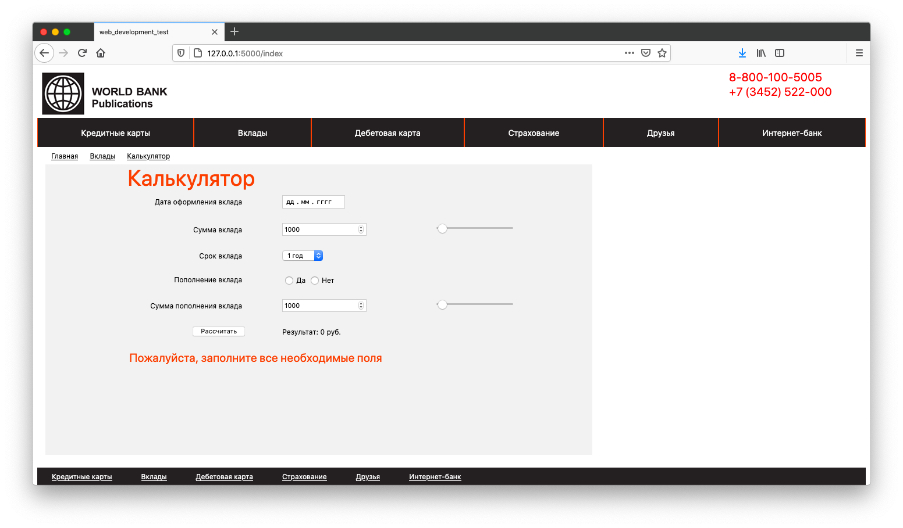

# IQ Online test task:
## Тестовое задание для web-разработчика
### Используемый стек технологий:
При реализации данного задания были использован следующий стек:

<code>python3</code>, <code>flask</code>, <code>jinja2</code>, <code>html5</code>, <code>css</code>

### Docker
Для корректной работы контейнера расскоментируйте строчку в [run.py](https://github.com/froOst23/iq-online-test-task/blob/master/run.py):

<code>app.run(debug=True, host='0.0.0.0')</code>

Для сборки docker контейнера используйте следующую команду:

<code>docker build -t *container_name:tag* .</code>

Для запуска docker контейнера используйте 
следующую команду:

<code>docker run -p 5000:5001 *container_name:tag*</code>